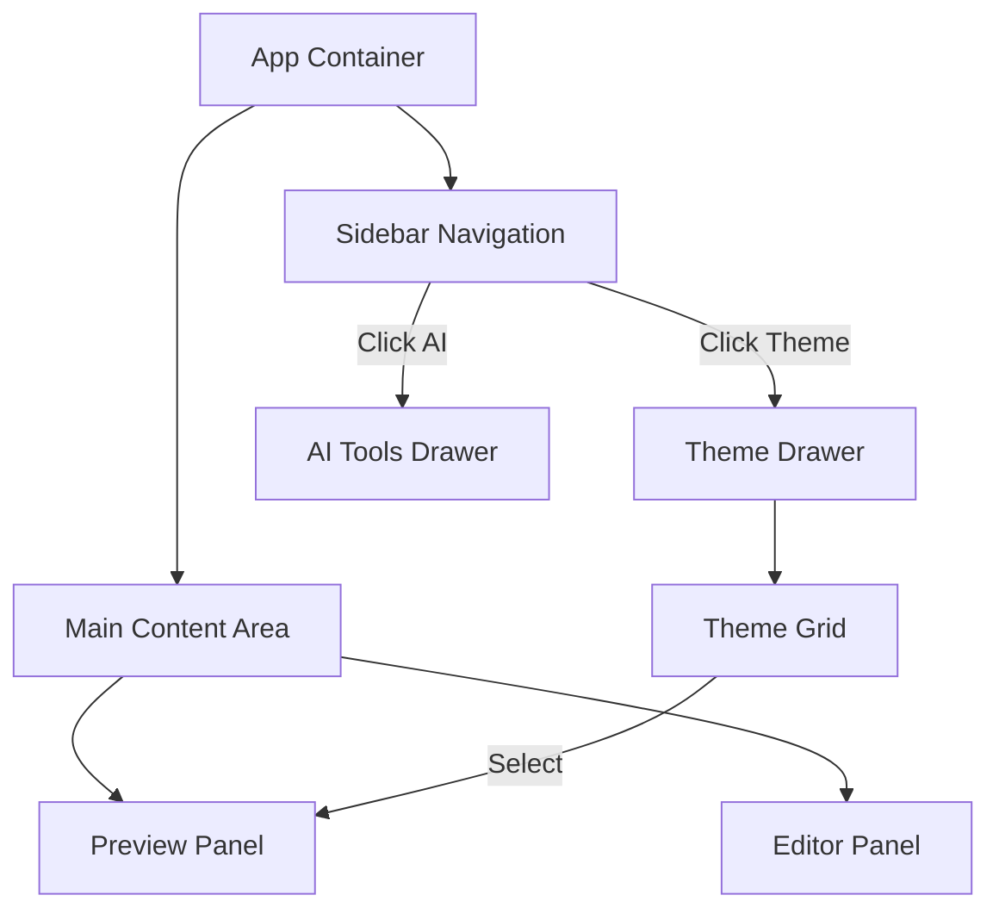

# UI 重设计与多主题扩展方案

## 📋 任务信息
- 类型：🔴 大功能 (L)
- 预计时间：4 小时
- 创建时间：2025-11-28
- 状态：已完成

## 🎯 目标
1. **UI 重设计**：从单纯的“顶部工具栏 + 分栏”布局，升级为更专业的“侧边导航 + 功能面板”布局，提升工具的易用性和扩展性。
2. **主题扩展**：新增多种风格主题，满足不同场景（科技、节日、学术等）的需求。
3. **交互升级**：优化主题选择交互，从“横向滚动”改为“侧边网格面板”，支持预览和快速切换。

## 🔧 技术方案

### 1. 布局重构 (Layout Redesign)
采用 **"三栏式"** 或 **"侧边导航式"** 布局：
- **左侧边栏 (Sidebar)**：放置一级功能入口（主题库、AI 工具箱、设置、关于）。
- **侧滑面板 (Drawer/Panel)**：点击左侧入口时展开，显示具体内容（如主题网格列表）。
- **编辑器 (Center)**：核心编辑区域。
- **预览区 (Right)**：保持手机模拟器样式，但优化视觉细节。

### 2. 交互调整 (Interaction)
- **主题选择**：
  - 点击左侧“主题”图标，弹出主题面板。
  - 面板内使用 **Grid 网格布局** 展示主题卡片。
  - 每个卡片显示主题的配色预览（色块组合）。
  - 支持 Hover 预览或点击即时应用。

### 3. 新增主题 (New Themes)
已新增以下 5 款主题：
1.  **科技极客 (Tech Geek)**：黑白灰主调，等宽字体标题，适合技术文章。
2.  **中国风 (Chinese Red)**：红金配色，衬线体，适合节日/传统文化。
3.  **学术论文 (Academic)**：衬线体，极简边框，类似论文排版，适合严肃内容。
4.  **马卡龙 (Macaroon)**：柔和的粉/蓝/黄撞色，圆角大，适合情感/生活类。
5.  **杂志风 (Magazine)**：大色块拼接，高对比度，适合时尚/前卫内容。

## 🏗️ 架构设计

## 📋 实施计划
- [x] **Step 1: 主题扩展 (constants.ts)** (1h)
    - 定义 5 个新主题的样式对象。
- [x] **Step 2: UI 框架重构 (App.tsx)** (1.5h)
    - 引入 Sidebar 组件。
    - 实现 Drawer/Panel 机制。
    - 调整 Flex 布局。
- [x] **Step 3: 主题面板开发 (components/ThemePanel.tsx)** (1h)
    - 实现网格布局。
    - 设计主题预览卡片 (Color Palette Preview)。
- [x] **Step 4: 细节打磨 & 响应式适配** (0.5h)
    - 确保移动端适配（或提示仅桌面端可用）。

## ✅ 验收标准
- [x] 界面成功切换为侧边栏布局。
- [x] 主题选择器支持网格展示，且能显示 8+ 个主题。
- [x] 新增的 5 个主题渲染正常，无样式冲突。
- [x] AI 工具等原有功能在布局调整后依然可用。

## ✅ 交付清单
### 📝 代码变更
- `App.tsx` - 重构为侧边栏布局，集成 Drawer 机制。
- `constants.ts` - 新增 5 款主题样式。
- `components/ThemePanel.tsx` - 新增主题选择面板组件。

### 📊 验证结果
- ✅ 侧边栏导航顺滑，Tab 切换正常。
- ✅ 11 款主题（6旧+5新）均可正常渲染。
- ✅ AI 工具面板功能迁移完成。
