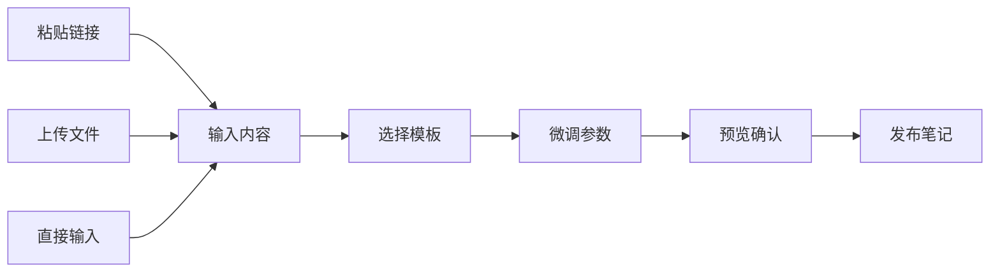

# UPlog (uplog.cc) 产品分析报告

> 📅 分析日期：2024-12-20  
> 🔗 网站地址：https://uplog.cc/

---

## 📸 分析过程录屏


## 📷 关键截图

````carousel

<!-- slide -->

````

---

## 1. 产品概述

**UPlog** 是一款专为**小红书创作者**设计的图文排版工具。它帮助创作者将来自不同平台（如微信公众号、Notion、飞书）的内容一键转化为精美的小红书图片卡片，极大简化了跨平台内容迁移和视觉排版的流程。

### 核心价值主张
- 🚀 **一键导入**：支持从微信公众号、飞书、Notion 等平台直接导入内容
- 🎨 **丰富模板**：提供多种精美预设模板，快速生成专业级图文卡片
- ⚡ **即时发布**：通过浏览器插件实现免下载直接发布到小红书

---

## 2. 视觉设计系统 (Design System)

### 2.1 整体布局结构

页面采用**三栏式布局**，逻辑清晰，符合创作工具的使用习惯：

```
┌────────────────────────────────────────────────────────────────┐
│  顶部导航栏 (Header)                                             │
├──────────────┬──────────────────────┬─────────────────────────┤
│   编辑器区域   │     实时预览区域       │      控制面板           │
│   (Editor)   │    (Live Preview)    │   (Control Panel)      │
│              │                      │                        │
│  • 标题输入   │   📱 手机屏幕比例     │   [模板库] [调整]       │
│  • 正文编辑   │      卡片预览         │                        │
│  • 导入入口   │                      │   • 模板选择           │
│              │                      │   • 参数调节           │
└──────────────┴──────────────────────┴─────────────────────────┘
```

| 区域 | 位置 | 功能描述 |
|------|------|----------|
| **编辑器区域** | 左侧 | 标题输入（限64字）、正文编辑、内容导入入口 |
| **实时预览区域** | 中间 | 以手机屏幕比例展示卡片效果，支持多页预览 |
| **控制面板** | 右侧 | 分为"模板库"和"调整"两个标签页 |

---

## 3. 设计风格详细分析 (Design Style Deep Dive)

### 3.1 整体设计理念

UPlog 采用**「工具型极简主义」**设计语言，核心理念是**"让工具隐于无形，让内容成为主角"**。

#### 设计哲学
- **功能至上 (Function First)**：每个UI元素都服务于明确的功能目的，没有纯装饰性元素
- **减少干扰 (Minimal Distraction)**：通过中性色调和克制的视觉层次，让用户专注于创作内容
- **即时反馈 (Instant Feedback)**：实时预览机制确保用户每一步操作都能看到结果

### 3.2 色彩体系 (Color System)

#### 主色调分析

| 色彩角色 | 色值 | RGB | 应用场景 | 设计意图 |
|----------|------|-----|----------|----------|
| **背景基色** | `#F5F5F5` | rgb(245,245,245) | 页面整体背景 | 低饱和度灰色减少视觉疲劳，营造专业创作氛围 |
| **内容承载色** | `#FFFFFF` | rgb(255,255,255) | 编辑区、卡片背景 | 纯白提供最佳阅读对比度，暗示"画布"概念 |
| **主要文字** | `#333333` | rgb(51,51,51) | 标题、正文 | 非纯黑设计，减少刺眼感同时保持可读性 |
| **次要文字** | `#999999` | rgb(153,153,153) | 占位符、提示 | 明显区分层级，避免信息干扰 |
| **边框分隔** | `#E5E5E5` | rgb(229,229,229) | 区域分隔线 | 极淡的视觉引导，不抢夺注意力 |

#### 功能色与品牌色

| 色彩 | 色值 | 应用场景 | 视觉心理 |
|------|------|----------|----------|
| **微信绿** | `#07C160` | 公众号导入图标 | 信任感、熟悉感，借用微信品牌认知 |
| **飞书蓝** | `#3370FF` | 飞书导入图标 | 专业、效率，呼应飞书品牌调性 |
| **Notion黑** | `#000000` | Notion导入图标 | 极简、高端，符合Notion用户审美 |
| **VIP金** | 线性渐变 `#FFD700→#FFA500` | 解锁VIP按钮 | 价值感、尊贵感，暗示付费价值 |
| **主操作色** | `#1677FF` | 发布按钮 | 行动引导，高对比度吸引点击 |

#### 色彩情绪板 (Color Mood)

```
┌─────────────────────────────────────────────────────────────┐
│                                                             │
│   ██████ #F5F5F5    专业 · 克制 · 中性                      │
│   ██████ #FFFFFF    纯净 · 聚焦 · 画布                      │
│   ██████ #333333    权威 · 可读 · 层次                      │
│   ██████ #1677FF    行动 · 引导 · 主要                      │
│   ██████ #FFD700    价值 · 高端 · 转化                      │
│                                                             │
└─────────────────────────────────────────────────────────────┘
```

### 3.3 字体与排版 (Typography)

#### 字体选择

| 类型 | 字体 | 备选 | 使用场景 |
|------|------|------|----------|
| **界面字体** | 苹方 (PingFang SC) | 微软雅黑, SF Pro | 按钮、标签、导航 |
| **内容字体** | 可选多种 | 通过调整面板切换 | 卡片内标题、正文 |

#### 字号体系 (Type Scale)

```
标题层级：
  H1: 24px - 页面主标题（卡片标题）
  H2: 18px - 区块标题（模板库、调整）
  H3: 16px - 子标题

正文层级：
  Body: 14px - 主要正文
  Caption: 12px - 辅助说明、提示文字
  
行高：
  标题: 1.4
  正文: 1.6 - 1.8（可调节）
```

#### 排版特征

- **左对齐为主**：符合中文阅读习惯，提升扫读效率
- **适度字间距**：针对小红书卡片阅读优化，默认轻微加宽
- **段落间距明确**：清晰的内容分块，避免视觉拥挤

### 3.4 间距与栅格 (Spacing & Grid)

#### 间距系统 (Spacing Scale)

采用 **4px 基础单位**的倍数系统：

| 尺寸代号 | 值 | 应用场景 |
|----------|-----|----------|
| **xs** | 4px | 图标与文字间距 |
| **sm** | 8px | 紧凑元素间距 |
| **md** | 16px | 标准元素间距 |
| **lg** | 24px | 区块内间距 |
| **xl** | 32px | 区块间间距 |
| **2xl** | 48px | 大区域分隔 |

#### 栅格系统

```
整体布局：
├── 左栏 (Editor)      : ~30% 宽度
├── 中栏 (Preview)     : ~40% 宽度  
└── 右栏 (Control)     : ~30% 宽度

内边距 (Padding)：
├── 页面边距          : 24px
├── 卡片内边距        : 16px
└── 元素内边距        : 12px
```

### 3.5 圆角与阴影 (Border Radius & Shadow)

#### 圆角体系

| 元素类型 | 圆角值 | 视觉效果 |
|----------|--------|----------|
| **按钮** | 6px | 柔和亲和，易于点击 |
| **输入框** | 4px | 轻微圆角，专业感 |
| **卡片容器** | 8px | 明显圆润，现代感 |
| **模态框** | 12px | 突出层级，友好感 |
| **模板缩略图** | 4px | 轻微圆角，整齐感 |

#### 阴影体系

```css
/* 层级阴影 */
--shadow-sm: 0 1px 2px rgba(0,0,0,0.05);     /* 轻微浮起 */
--shadow-md: 0 4px 12px rgba(0,0,0,0.08);    /* 卡片浮层 */
--shadow-lg: 0 8px 24px rgba(0,0,0,0.12);    /* 模态框 */
```

### 3.6 图标设计语言 (Iconography)

#### 图标风格特征

| 特征 | 描述 |
|------|------|
| **线描风格 (Outlined)** | 采用1.5-2px线宽的线描图标，轻盈不沉重 |
| **圆角端点** | 线条端点采用圆角处理，柔和友好 |
| **统一视觉重量** | 所有图标保持相似的视觉密度 |
| **24x24 标准尺寸** | 功能图标统一尺寸，保持一致性 |

#### 图标应用示例

```
📤 导入图标     - 线描箭头向上，暗示上传/导入
📝 编辑图标     - 铅笔形态，编辑功能通用符号  
🎨 模板图标     - 网格/布局形态，暗示排版
⚙️ 调整图标     - 滑块形态，暗示参数调节
```

### 3.7 动效与过渡 (Animation & Transition)

#### 过渡动画

| 场景 | 动画类型 | 时长 | 缓动函数 |
|------|----------|------|----------|
| **按钮悬停** | 背景色变化 | 200ms | ease-out |
| **模板切换** | 预览区淡入淡出 | 300ms | ease-in-out |
| **面板切换** | 内容滑动 | 250ms | ease |
| **模态框弹出** | 缩放+淡入 | 200ms | ease-out |

#### 动效设计原则

- **克制使用**：只在必要的交互反馈处使用动画
- **快速响应**：动画时长控制在 200-300ms，不影响效率
- **自然流畅**：采用 ease 类缓动，模拟物理运动

### 3.8 响应式设计策略 (Responsive Design)

#### 断点系统

| 断点 | 宽度 | 布局调整 |
|------|------|----------|
| **Desktop** | ≥1200px | 完整三栏布局 |
| **Tablet** | 768-1199px | 控制面板可折叠 |
| **Mobile** | <768px | 单栏垂直堆叠 |

### 3.9 设计风格总结

#### 风格关键词

```
┌─────────────────────────────────────────────────────────────┐
│                                                             │
│   极简主义 · 工具导向 · 中性专业 · 现代清爽                  │
│                                                             │
│   Minimalist · Tool-focused · Neutral Professional · Modern │
│                                                             │
└─────────────────────────────────────────────────────────────┘
```

#### 对标参考产品

| 产品 | 相似点 |
|------|--------|
| **Notion** | 极简界面、内容为先 |
| **Figma** | 三栏布局、实时预览 |
| **Canva** | 模板库、拖拽式操作 |
| **语雀** | 中文排版优化、文档工具 |

---

## 4. 色彩体系详表 (Color Palette)

| 色彩类型 | 色值/描述 | 用途 |
|----------|-----------|------|
| **背景色** | `#F5F5F5` 浅灰 | 页面整体背景 |
| **内容区背景** | `#FFFFFF` 纯白 | 编辑块、卡片背景 |
| **主文字** | `#333333` 深灰 | 标题、正文内容 |
| **辅助文字** | `#999999` 浅灰 | 占位符、提示文字 |
| **微信/公众号** | `#07C160` 绿色 | 功能图标标识 |
| **飞书** | `#3370FF` 蓝色 | 功能图标标识 |
| **Notion** | `#000000` 黑色 | 功能图标标识 |
| **VIP 高亮** | 金色渐变 | VIP 按钮、高级功能标识 |

---

## 5. 核心功能特性 (Features)

### 5.1 内容创作与导入

#### 📥 多平台一键导入

无需复制粘贴，支持直接通过链接导入：

| 平台 | 支持格式 | 图标颜色 |
|------|----------|----------|
| 微信公众号 | 文章链接 | 🟢 绿色 |
| 飞书文档 | 文档链接 | 🔵 蓝色 |
| Notion | 页面链接 | ⚫ 黑色 |

#### 📄 本地文件上传

支持格式：
- `.doc` / `.docx` - Word 文档
- `.md` - Markdown 文件

#### ✏️ 自由编辑

- 所见即所得的编辑器
- 实时保存，无需手动操作
- 标题限制 64 字符

### 5.2 模板与排版系统

#### 🎨 模板库

提供多种预设模板风格：

| 模板名称 | 适用场景 | 特点 |
|----------|----------|------|
| **简单格子** | 文字干货、知识分享 | 简洁清爽 |
| **彩页随笔** | 情绪表达、生活记录 | 色彩丰富 |
| **纸纹背景** | 文艺风格、读书笔记 | 模拟纸张质感 |
| **VIP 专属模板** | 高级设计需求 | 需解锁 VIP |

#### 🔄 智能排版

- 系统自动将标题、正文、配图填充进卡片
- 自动匹配间距，保持视觉平衡
- 点击右侧模板即可**实时切换**效果

### 5.3 深度调节面板 (Adjust Settings)

| 调节项 | 选项 |
|--------|------|
| **卡片比例** | 3:5, 3:4 等小红书主流比例 |
| **字体类型** | 多种可选字体 |
| **标题字号** | 最小 / 小 / 中 / 大 / 最大 |
| **正文字号** | 最小 / 小 / 中 / 大 / 最大 |
| **对齐方式** | 左对齐 / 居中 / 右对齐 |
| **行高** | 精细化调节 |
| **字间距** | 精细化调节 |

---

## 6. 交互设计 (Interactions)

### 6.1 核心用户流程 (User Flow)



**详细步骤**：

| 步骤 | 操作 | 说明 |
|------|------|------|
| **Step 1** | 输入 | 通过底部图标导入内容或直接在左侧输入 |
| **Step 2** | 选样 | 在右侧模板库选择合适的风格及配色 |
| **Step 3** | 微调 | 点击"调整"标签，优化文字细节 |
| **Step 4** | 发布 | 点击右上角"发布笔记"按钮 |

### 6.2 特色交互元素

#### 🎨 颜色选择器
- 每个模板下方带有**圆色块**
- 点击即可快速切换该模板的主题配色
- 无需离开当前视图

#### 📑 预览分页器
- 预览区底部显示 `1/1`, `1/2` 等分页符
- 支持多图卡片创作
- 左右滑动切换预览页

#### 🔌 浏览器插件安装

点击"安装插件"后弹出模态框，核心功能：

| 功能 | 描述 |
|------|------|
| **免导出上传** | 直接将排版内容同步到小红书网页版后台 |
| **支持浏览器** | Chrome, Edge, 360 等主流浏览器 |

### 6.3 登录方式

- **微信扫码登录**：无需注册账号
- 关注公众号即可完成登录
- 极大降低用户进入门槛

---

## 7. 顶部导航栏 (Header Navigation)

| 元素 | 类型 | 功能 |
|------|------|------|
| **Logo** | 品牌标识 | 点击回到首页 |
| **使用教程** | 链接 | 跳转到详细使用指南（微信图文） |
| **安装插件** | 按钮 | 弹出插件安装模态框 |
| **解锁 VIP** | 按钮（金色） | 触发登录，查看 VIP 权益 |
| **发布笔记** | 主要按钮 | 执行最终发布操作 |

---

## 8. 商业模式

### 8.1 VIP 会员体系

| 权益 | 免费用户 | VIP 用户 |
|------|----------|----------|
| 基础模板 | ✅ | ✅ |
| 高级模板 | ❌ | ✅ |
| 导入功能 | ✅ | ✅ |
| 去水印 | ❌ | ✅ |

> [!NOTE]
> 部分精美、高级模板标有 **VIP** 标识，需要解锁会员后使用。

### 8.2 用户获取策略

- **微信公众号登录**：自然沉淀用户到私域
- **详细使用教程**：降低上手门槛，提高留存
- **浏览器插件**：提供差异化功能，增强粘性

---

## 9. 技术与性能特点

| 特点 | 描述 |
|------|------|
| **实时预览** | 编辑内容后预览区即时更新 |
| **响应式设计** | 适配不同屏幕尺寸 |
| **低延迟** | 模板切换、参数调整流畅无卡顿 |
| **云端存储** | 支持草稿自动保存 |

---

## 10. 总结与亮点

### ✨ 产品亮点

1. **精准定位**：专注小红书创作者的排版痛点
2. **跨平台导入**：一键从公众号、飞书、Notion 导入内容
3. **丰富模板**：多种精美预设，快速出图
4. **即时发布**：浏览器插件实现无缝发布
5. **低门槛登录**：微信扫码，无需注册

### 🎨 设计语言总结

| 维度 | 特征 |
|------|------|
| **整体风格** | 工具型极简主义 |
| **色彩基调** | 中性灰白 + 功能色点缀 |
| **字体策略** | 系统字体优先，可选切换 |
| **间距系统** | 4px 基础单位倍数 |
| **圆角处理** | 4-12px 柔和圆角 |
| **阴影层级** | 三级阴影体系 |
| **动效原则** | 快速、克制、自然 |
| **图标风格** | 线描、圆角、统一 |

### 📊 用户价值

UPlog 将原本繁琐的**内容迁移 + 美术排版**工作缩减到**分钟级**，帮助小红书创作者专注于内容本身，而非排版技术。

---

> 本报告基于 2024-12-20 的网站分析生成，产品可能随时间迭代更新。
